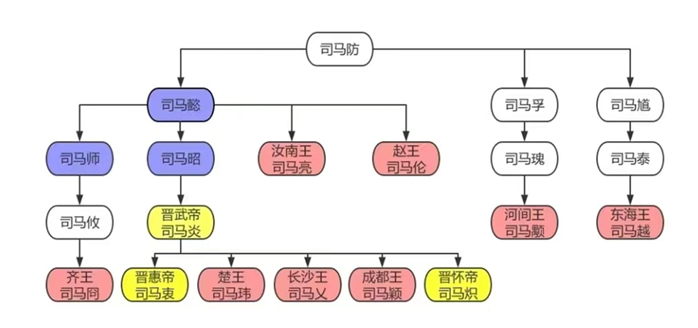

# PKU-Database-Project-3

本次实习的目标是请同学们掌握一些典型的非关系数据类型在关系数据库中的处理手段。主要包括如下几方面的练习：

1. 递归查询

2. JSON和关系表的导入导出和基本查询

3. 向量数据库的使用

## 一、递归查询

递归查询我们提供如下两个问题，同学们选择其中一个完成。

1、下面是八王之乱的亲属关系示意图，我们先把它存入一个family表中，记录图中直接的父子关系。



```sql
create table  family( father char(10), son char(10) );
insert into family values 
(‘司马防’,’司马懿’),
(‘司马防’,’司马孚’),
(‘司马防’,’司马馗’),
(‘司马懿’,’司马师’),
(‘司马懿’,’司马昭’),
(‘司马懿’,’司马亮’),
(‘司马懿’,’司马伦’),
(‘司马孚’,’司马瑰’),
(‘司马馗’,’司马泰’),
(‘司马师’,’司马攸’),
(‘司马昭’,’司马炎’),
(‘司马昭’,’司马炎’),
(‘司马瑰’,’司马颙’),
(‘司马攸’,’司马囧’),
(‘司马炎’,’司马衷’),
(‘司马炎’,’司马玮’),
(‘司马炎’,’司马乂’),
(‘司马炎’,’司马颖’),
(‘司马炎’,’司马炽’);
```

我们定义如下规则：

brother(X,Y):-father(Z,X),father(Z,Y). 有共同父亲的是兄弟。

ancestor(X,Y):-father(X,Y). 父亲是祖先。

ancestor(X,Y):-father(X,Z),ancestor(Z,Y).父亲的祖先是祖先。

请同学们完成如下SQL查询：

1) 找出所有的兄弟关系。
2) 使用递归查询找出所有祖先关系。

2、下面是用大模型生成的倚天屠龙记的人物关系图谱，用三元组来表示。同学们把它们存入一个(source_node, relation_tag, target_node)表中，然后完成如下查询任务：给定两个节点，返回这两个节点之间的最短路径。（同学们也可以用构造其他的关系图谱）

```sql
(‘张三丰’, ’师父’, ’张翠山’), 

(‘张三丰’, ’师父’, ’俞莲舟’), 

(‘张三丰’, ’师父’, ’宋远桥’), 

(‘张翠山’, ’妻子’, ’殷素素’), 

(‘张翠山’, ’义兄’, ’谢逊’), 

(‘殷素素’, ’父亲’, ’殷天正’), 

(‘殷素素’, ’哥哥’, ’殷野王’), 

(‘殷野王’, ’女儿’, ’殷离’), 

(‘谢逊’, ’义父’, ’张无忌’), 

(‘谢逊’, ’师父’, ’成昆’), 

(‘成昆’, ’师妹’, ’阳顶天夫人’), 

(‘成昆’, ’徒弟’, ’陈友谅’), 

(‘阳顶天’, ’妻子’, ’阳顶天夫人’), 

(‘张无忌’, ’妻子’, ’赵敏’), 

(‘张无忌’, ’未婚妻’, ’周芷若’), 

(‘张无忌’, ’表妹’, ’殷离’), 

(‘张无忌’, ’侍女’, ’小昭’), 

(‘周芷若’, ’师父’, ’灭绝师太’), 

(‘灭绝师太’, ’敌对’, ’张三丰’), 

(‘杨逍’, ’女儿’, ’杨不悔’), 

(‘杨逍’, ’恋人’, ’纪晓芙’), 

(‘纪晓芙’, ’师父’, ’灭绝师太’), 

(‘杨不悔’, ’丈夫’, ’殷梨亭’), 

(‘殷梨亭’, ’师兄’, ’宋远桥’), 

(‘殷梨亭’, ’师兄’, ’俞莲舟’), 

(‘小昭’, ’母亲’, ’黛绮丝’), 

(‘黛绮丝’, ’义兄’, ’谢逊’), 

(‘黛绮丝’, ’女儿’, ’小昭’), 

(‘朱元璋’, ’下属’, ’张无忌’), 

(‘成昆’, ’敌对’, ’谢逊’), 

(‘周芷若’, ’杀害’, ’殷离’), 

(‘周芷若’, ’嫁祸’, ’赵敏’), 

(‘黄衫女子’, ’祖先’, ’杨过’), 

(‘空见’, ’师父’, ’成昆’), 

(‘陈友谅’, ’师父’, ’成昆’), 

(‘宋青书’, ’父亲’, ’宋远桥’), 

(‘宋青书’, ’妻子’, ’周芷若’), 

(‘常遇春’, ’下属’, ’张无忌’), 

(‘徐达’, ’下属’, ’张无忌’), 

(‘胡青牛’, ’妻子’, ’王难姑’), 

(‘胡青牛’, ’恩人’, ’张无忌’), 

(‘王难姑’, ’丈夫’, ’胡青牛’)  
```

## 二、JSON操作

同学们选择我们课程的某个章节，结合大模型生成课程某个章节的内容，并以JSON格式输出，然后将其存入一个表中，定义一个JSON类型的字段来存储大模型的输出内容。

同学们的任务包括如下两项：

1. 自己设计两个查询实例，分别查询特定字段的值以及特定数组的元素数目。

2. 把JSON的嵌套结构展开，存入一个1NF平面表中。

下面是我用大模型生成的一个JSON文档，供参考。

```json
{
    "chapter": "关系规范化理论",
    "sections": [
        {
            "section_title": "基本概念与问题引入",
            "knowledge_points": [
                {
                    "key_point": "关系模式设计问题",
                    "explanation": "非规范化关系模式会导致数据冗余、插入异常、更新异常和删除异常。例如学生选课表中存储系主任信息时，会导致系主任信息重复存储（冗余）且无法独立维护（异常）",
                    "qa": {
                        "question": "非规范化关系模式可能引发哪些问题？请举例说明。",
                        "answer": "数据冗余（如系主任信息重复存储）、插入异常（无法单独插入未选课学生的系信息）、更新异常（修改系主任需更新多条记录）、删除异常（删除最后一条学生记录会丢失系信息）"
                    }
                },
                {
                    "key_point": "函数依赖",
                    "explanation": "描述属性间逻辑关系的约束，包括完全依赖、部分依赖和传递依赖。如学号→系名是完全依赖，(学号,课程)→成绩是部分依赖，学号→系主任是传递依赖",
                    "qa": {
                        "question": "什么是传递函数依赖？请用学生-系-系主任的例子说明。",
                        "answer": "若存在学号→系名，系名→系主任，且系名↛学号，则系主任传递依赖于学号"
                    }
                }
            ]
        },
        {
            "section_title": "范式体系",
            "knowledge_points": [
                {
                    "key_point": "第一范式（1NF）",
                    "explanation": "属性值不可再分，消除重复组。如将包含多值的地址字段拆分为省、市、街道",
                    "qa": {
                        "question": "判断表结构是否满足1NF：商品表(商品ID, 商品名称, 规格['红色','L'])",
                        "answer": "不满足1NF，'规格'字段包含多个值，需拆分为独立属性或新建规格表"
                    }
                },
                {
                    "key_point": "第二范式（2NF）",
                    "explanation": "消除非主属性对候选键的部分依赖。如将(学号,课程,学分)分解为选课表和课程表",
                    "qa": {
                        "question": "为什么(学号,课程)→姓名的设计违反2NF？如何修正？",
                        "answer": "姓名仅依赖学号（候选键部分），应拆分为学生表(学号,姓名)和选课表(学号,课程)"
                    }
                },
                {
                    "key_point": "第三范式（3NF）",
                    "explanation": "消除非主属性的传递依赖。如将学生表拆分为学生-系表和系-主任表",
                    "qa": {
                        "question": "关系模式R(工号,部门,经理)是否满足3NF？若不满足请分解。",
                        "answer": "不满足（工号→部门→经理）。应分解为R1(工号,部门)和R2(部门,经理) "
                    }
                },
                {
                    "key_point": "BCNF范式",
                    "explanation": "所有决定因素都包含候选键。如解决(课程,教师)→教材且教师→课程的依赖",
                    "qa": {
                        "question": "判断R(A,B,C)是否满足BCNF：依赖集{A→B, B→A, A→C}",
                        "answer": "不满足。候选键为A/B，但A→C中C是非主属性，分解为R1(A,B)和R2(A,C)"
                    }
                }
            ]
        },
        {
            "section_title": "规范化实践",
            "knowledge_points": [
                {
                    "key_point": "模式分解原则",
                    "explanation": "需满足无损连接性和保持函数依赖。如通过自然连接可恢复原表且不丢失依赖关系",
                    "qa": {
                        "question": "分解后的两个子模式如何验证无损连接性？",
                        "answer": "使用矩阵法：若存在某行全为a，或通过函数依赖推导可使某行全为a，则为无损分解"
                    }
                },
                {
                    "key_point": "反规范化策略",
                    "explanation": "在查询性能与规范化间权衡，适度冗余。如订单表增加客户姓名字段避免频繁连接查询",
                    "qa": {
                        "question": "什么场景下需要反规范化？请举例说明。",
                        "answer": "高频复杂查询（如报表统计），可增加汇总字段或冗余关联字段（如商品详情页展示分类名称）"
                    }
                }
            ]
        }
    ],
    "question_bank": [
        {
            "question": "Armstrong公理包含哪些基本规则？",
            "answer": "自反律（若Y⊆X则X→Y）、增广律（X→Y则XZ→YZ）、传递律（X→Y且Y→Z则X→Z）"
        },
        {
            "question": "如何求属性集X的闭包？",
            "answer": "通过反复应用函数依赖，直到不再有新属性加入。例如F={A→B,B→C}，则A⁺=ABC "
        },
        {
            "question": "候选键的判定条件是什么？",
            "answer": "候选键K需满足K的闭包包含所有属性，且K的任何真子集闭包不包含全部属性"
        }
    ]
}
```

## 三、向量数据库实习设计

 

这部分我们的实习设计的比较简单，就是熟悉一下向量嵌入，以及数据库里面向量相似性检索的插件就可以了。

我们提供了一个Jupyter文件，里面包括SQLite里面向量插件的使用，以及生成向量嵌入的Python包的使用。

实验用的数据集放在sts-b-train.txt中，格式如下，前面是两个句子，后面的数字代表这两个句子的相似性。因为这是一个训练集，所以相似值已经给定了，同学们要做的是生成两个句子的向量嵌入，然后调用SQLite的向量插件来计算它们的相似性，并和现有的相似值做个比较。可以截取一部分数据，另外也可以用其他数据库的向量插件。

```text
一架飞机要起飞了。  一架飞机正在起飞。  5

一个男人在吹一支大笛子。    一个人在吹长笛。    3

三个人在下棋。  两个人在下棋。  2

一个人在拉大提琴。  一个坐着的人正在拉大提琴。  4

有些人在战斗。  两个人在打架。  4

一个男人在抽烟。    一个男人在滑冰。    0

那人在弹钢琴。  那人在弹吉他。  1

一个男人在弹吉他和唱歌。    一位女士正在弹着一把原声吉他，唱着歌。  2

一个人正把一只猫扔到天花板上。  一个人把一只猫扔在天花板上。    5
```
